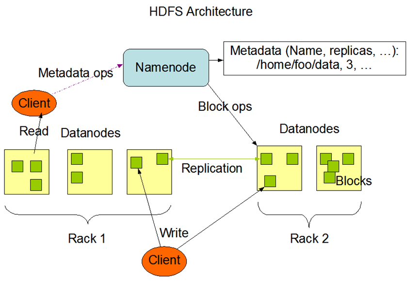
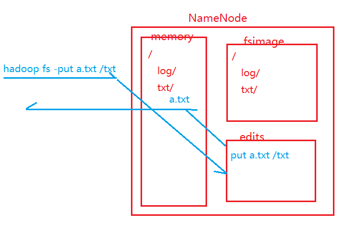

### HDFS

---
HDFS是Hadoop中用于进行数据分布式存储的模块


#### 概述
1. HDFS中，存储数据时会将数据进行切块，每一个块称之为Block。
2. HDFS中，主要包含2个重要的进程：NameNode和DataNode。
   1. NameNode用于管理节点和记录元数据(metadata)。
   2. DataNode是用于存储数据。
3. HDFS会对数据自动进行备份，称之为副本（replication）。如果不指定，默认情况下副本数量为3(额外复制两次，加上原来的数据构成3个副本)。
4. HDFS仿照Linux设计了一套文件存储系统。

#### Block
1. 在HDFS中，数据都是以Block为单位进行存储的。
2. Block 默认的大小在Hadoop1.0中是64M，在Hadoop2.0中是128M，通过dfs.blocksize来调节大小。
3. 如果一个文件不足一个Block大小，则这个文件整体作为一个Block存储，并且Block的大小和文件大小是一致的。
4. 会给每一个Block一个编号，称之为BlockID，通过BlockID，能够确定Block的顺序。
5. 同一个Block的不同副本一定是在不同节点上，但是不同Block的副本可能在一个节点上。
6. Block的意义：
   1. 文件块可以保存在不同的节点上，能够存储超大文件。
   2. 有利于数据的复制，便于快速备份。
   
#### NameNode
1. NameNode用于存储元数据，管理DataNode节点。
2. NameNode会将管理的数据块信息放入数据块池（Block Pool）中。
3. NameNode维护HDFS中的元数据信息：
   1. 文件的存储路径
   2. 文件权限
   3. 文件大小以及块的大小
   4. BlockID
   5. Block的存储节点
   6. 副本数量
4. NameNode会将元数据存储在内存以及磁盘中
   1. 存储在内存中的目的是为了快速查询。
   2. 存储在磁盘中的目的是为了崩溃恢复。
5. 元数据的存储路径由hadoop.tmp.dir来决定。
6. 元数据的存储文件：
   1. edits：记录写操作的文件。
   2. fsimage：映像文件。记录元数据，但是这个文件中的元数据和内存中的元数据并不是同步的，fsimage中的元数据往往是落后于内存中的元数据的。
7. NameNode在接收到写操作的时候，先将这个操作记录到edits_inprogress文件中，如果记录成功，则更改内存中的元数据，内存中的元数据更改成功之后会给客户端返回成功信号。这样设计的目的是为了保证操作的可靠 - 只要记录成功了，这个操作就一定会执行。

8. fsimage更新/edits滚动的触发条件：
   1. 空间：当edits文件达到指定大小（默认是64M，这个大小可以通过fs.checkpoint.size --- core-site.xml来调节）的时候，会触发edits文件的滚动。
   2. 时间：当距离上次滚动间隔指定时间（默认是3600s，这个时间可以通过fs.checkpoint.period来调节）之后，会触发edits文件的滚动。
   3. 重启：当NameNode重启的时候，会触发edits文件的滚动。
   4. 强制：通过hadoop dfsadmin -rollEdits命令来强制edits文件滚动。
9. DataNode会通过心跳机制来向NameNode注册管理 - DataNode会定时的发送心跳信息给NameNode。
10. DataNode会每隔3s给NameNode发送一次心跳 - 心跳是通过RPC机制发送。
11. 心跳信息：
    1. 当前DataNode中的Block信息。
    2. 当前DataNode的状态（预服役、服役、预退役）。
12. NameNode如果在10min没有收到DataNode的心跳，则认为这个DataNode已经lost，会将这个节点上的数据备份放到其他节点上保证整个集群中的副本数量。
13. NameNode重新启动之后，进行fsimage文件的更新/edits文件的滚动，将fsimage文件中的内容加载到内存中，等待DataNode的心跳，如果在指定的时间内没有等到心跳，则认为这个DataNode已经丢失需要对应处理；如果等到了心跳，那么NameNode对DataNode的数据进行校验，校验DataNode中的数据和元数据的记录是否一致，如果校验失败，则会试图恢复这个数据- 这个过程称之为安全模式(safe mode)。恢复之后，会再次校验，如果校验成功则自动退出安全模式并且对外提供服务；如果校验失败则重新恢复重新校验。
14. 在安全模式中，HDFS集群只对外提供读服务。
15. 也正因为有安全模式的校验问题，所以要求副本数量不能多于节点数量。
16. 如果在合理的时间内，集群没有自动退出安全模式，那么可能就已经产生了数据丢失并且这个数据不可恢复。
17. 强制退出安全模式：hadoop dfsadmin -safemode leave
18. 在Hadoop1.0中，NameNode存在单点故障问题。在Hadoop2.0的伪分布式中，NameNode依然存在单点故障，但是在Hadoop2.0的全分布式中，可以通过舍弃SecondaryNameNode的方式来配置2个NameNode来保证NameNode的高可用。

#### 副本放置策略
1. 第一个副本：
   1. 如果是集群内部上传，谁上传第一个副本就在谁身上。
   2. 如果是集群外部上传，则第一个副本会放在相对空闲的节点上。
2. 第二个节点：
   1. 在Hadoop2.7之前，第二个副本是放在和第一个副本不同机架的节点上。
   2. 从Hadoop2.7开始，第二个副本是放在和第一个副本相同机架的节点上。
3. 第三个副本：
   1. 在Hadoop2.7之前，第三个副本是放在和第二个副本相同机架的节点上。
   2. 从Hadoop2.7开始，第三个副本是放在和第二个副本不同机架的节点上。
4. 更多副本：哪一个节点空闲就放在哪里。

#### 机架感知策略
1. 所谓的机架感知策略中的机架指的是逻辑机架而不是物理机架。
2. 逻辑机架本质上就是一个映射关系，可以通过shell或者Python脚本指定。
3. 可以将不同物理机架上的节点配置在同一个逻辑机架上。
4. 习惯上，会将同一个同一个物理机架或者是同一个用户组内的节点配置在同一个逻辑机架上。

#### DataNode
1. 在HDFS中，数据是存放在DataNode上面的，并且是以Block的形式存储的。
2. 存储Block的路径也是由hadoop.tmp.dir属性来指定。
3. 在HDFS启动的时候，每个DataNode将当前存储的数据块信息告知NameNode节点，之后，DataNode节点会不断向NameNode节点发送心跳报告，默认是每隔3秒发送一次心跳信息。心跳信息包含这个节点的状态以及数据块信息。
4. 如果NameNode10分钟都没收到DataNode的心跳，则认为其已经lost，那么NameNode会copy这个DataNode上的Block到其他DataNode上。
5. 在HDFS中，DataNode上存储的复本Replication是多复本策略。默认是三个。如果是伪分布式模式，副本只能配置1个，因为如果副本数量>1，会导致HDFS一致处于安全模式而不能退出。

#### SecondaryNameNode
1. SecondaryNameNode并不是NameNode的热备份，而是协助者帮助NameNode进行元数据的合并，
2. 合并过程可能会造成极端情况下的数据丢失，此时可以从SecondaryNameNode中恢复部分数据，但是无法恢复全部
3. SecondaryNameNode是Hadoop1.0机制。Hadoop2.0已经弃用。如果是Hadoop2.0的伪分布式，还是会看到SecondaryNameNode进程；如果是Hadoop2.0的完全分布式，SecondaryNameNode已经舍弃
4. 合并时机：
   1. 根据配置文件设置的时间间隔：fs.checkpoint.period 默认3600秒。
   2. 根据配置文件设置的edits log大小 fs.checkpoint.size 默认64MB。
   3. 当HDFS启动时候,也会触发合并。
   4. 可以通过指令手动合并：hadoop dfsadmin -rollEdits。
5. 合并过程：
   1. 达到条件后 SecondaryNameNode会将nn中的fsimage和edits文件通过网络拷贝过来。
   2. 同时NameNode中会创建一个新的edits.new文件，新的读写请求会写入到这个edits.new中。
   3. 在SecondaryNameNode中，会将拷贝过来的fsimage和edits加载到内存中，将数据进行合并，然后将合并后的数据写到一个新的文件fsimage.ckpt中。
   4. 最后SecondaryNameNode将合并完成的fsimage.ckpt文件拷贝回NameNode中替换之前的fsimage，同时NameNode再将edtis.new重命名为edits。
。   
#### 回收站机制
1. HDFS中的回收站机制默认是不开启的。即从HDFS上删除文件的时候是立即删除的。
2. 可以通过配置来手动开启回收站，指定被删除文件的保留时间。
3. 配置：
   1. 进入Hadoop的安装目录下的子目录etc/hadoop：cd hadoop-2.7.1/etc/hadoop。
   2. 配置core-site.xml：
      1. 编辑core-site.xml：vim core-site.xml
      2. 添加如下内容
      ```
        <property>
            <name>fs.trash.interval</name>
            <value>1440</value>
        </property>
      ```
      3. 保存退出。
   3. 回收站的配置中，value的时间单位是分钟。如果配置程0，则表示不开启HDFS的回收站机制。配置为1440表示回收间隔为1天，即文件在回收站存在1天后，会被清除。

#### DFS目录
1. dfs目录表示HDFS的存储目录
   1. dfs/name表示NameNode的持久化目录
   2. dfs/data表示DataNode的存储目录
   3. dfs/namesecondary表示SecondaryNameNode的存储目录
2. 实际过程中，由于NameNode、DataNode以及SecondaryNameNode应该分布在不同的节点上，所以name、data、nameseconda三个目录也应该出现在不同的节点上
3. 当执行格式化指令时，会在指定的数据目录下，生成dfs/name目录
4. 当格式化后，启动HDFS前，会生成一个最初的fsimage_0000000000000000000文件，该文件中存储的根节点的信息
5. dfs/name/in_use.lock文件的作用是防止在同一台服务器上启动多个NameNode，避免管理紊乱
6. 当启动HDFS时，会生成edits文件
7. HDFS中有事务id的概念，当HDFS每接收一个写操作（比如：mkdir put mv），都会分配全局递增的事务id，然后写到edits文件中
8. 每生成一个新的edits文件，edits文件中都会以OP_START_LOG_SEGMENT开头，当一个edits文件写完后，会以OP_END_LOG_SEGMENT结尾。即在OP_START_LOG_SEGMENT- OP_END_LOG_SEGMENT存储的是这个edits文件所有的事务记录
9. edits_inprogress文件的作用是记录当前正在执行的事务文件。后面的编号是以上一次Txid+1来命名的
10. 初次使用HDFS时，有一个默认的edits和fsimage的合并周期（1分钟），以后在使用HDFS的过程中，达到条件edits_inprogress会和fsimage进行合并
11. 上传文件底层会拆分成如下的事务过程：
    1. OP_ADD 将文件加入到指定的HDFS目录下，并以._Copyging_结尾，表示此文件还未写完
	2. ALLOCATE_BLOCK_ID 为文件分配块ID
	3. SET_GENSTAMP_V2 为块生成时间戳版本号，是全局唯一的
	4. ADD_BLOCK 写块数据
	5. OP_CLOSE  表示块数据写完
	6. OP_RENAME_OLD 将文件重命名，表示写完
12. 当停止HDFS后再次启动HDFS时，当执行一个事务之后，底层会触发一次合并，然后生成一个新的edits文件
13. seen_txid记录是的最新的edits_inprogress文件末尾的数字
14. fsimage_N文件存储的N号事务前的所有的元数据信息
15. fsimage_N.md5存储的是fsimage文件的md5校验码，可以通过MD5的校验和来校验文件的完整性：md5sum fsimage_n

#### 读取流程
1. 客户端Client向NameNode发起RPC请求。
2. NameNode会视情况返回文件的部分或者全部Block列表，对于每个Block，NameNode都会返回有该Block拷贝的DataNode地址。
3. Client会选取离客户端最接近(所谓最近即响应速度最快的节点)的DataNode来读取Block；如果客户端本身就是DataNode,那么将从本地直接获取数据。
4. 读取完一个Block都会进行checksum验证，即验证读取到的Block大小和声明的Block大小是否一致，如果读取DataNode时出现错误，客户端会通知NameNode，然后再从下一个拥有该Block复本的DataNode重新读取。
5. 读取完当前Block的数据后，关闭与当前的DataNode连接，并为读取下一个Block寻找最佳的DataNode。
6. 当读完列表的block后，且文件读取还没有结束，客户端开发库会继续向NameNode获取下一批的block列表。
7. 当文件最后一个块也都读取完成后，客户端会连接NameNode告知关闭文件。

#### 写入流程
1. 客户端Client向NameNode发起RPC请求。
2. NameNode会检查要创建的文件是否已经存在，创建者是否有权限进行操作(用户也有不同的权限)，成功则会为文件创建一个记录，即NameNode记录元数据，否则会让客户端抛出异常。
3. 当客户端开始写入文件的时候，会将文件切分成多个packets（即对数据进行封包），并在内部以数据队列"data queue"的形式管理这些packets，并向NameNode申请新的地址，获取用来存储replications的合适的DataNode列表，列表的大小根据在NameNode中对replication的设置而定。
4. 客户端在获取到地址之后，开始以pipeline（管道）的形式将数据包写入所有的replications中。客户端把数据包以流的方式写入第一个DataNode，该DataNode把该数据包存储之后，再将其传递给在此pipeline中的下一个DataNode，直到最后一个DataNode，这种写数据的方式呈流水线的形式。
5. 最后一个DataNode成功存储之后会返回一个ack信号，在pipeline里传递至客户端。客户端在收到ack信号之后会继续写下一个Block。
6. 如果传输过程中，有某个DataNode出现了故障，那么当前的pipeline会被关闭，出现故障的DataNode会从当前的pipeline中移除， 剩余的Block会继续剩下的DataNode中继续以pipeline的形式传输，同时NameNode会分配一个新的DataNode，保持 replications设定的数量。

#### 删除流程
1. 客户端Client发起RPC请求到NameNode。
2. 先在NameNode上执行节点名字的删除，即删除对应的元数据。
3. 当NameNode执行delete方法时，它只标记操作涉及的需要被删除的数据块，而不会主动联系这些数据块所在的DataNode节点。
4. 当保存着这些数据块的DataNode节点向NameNode节点发送心跳时，在心跳应答里，NameNode节点会向DataNode发出指令，从而把数据删除掉。
5. 所以在执行完delete方法后的一段时间内，数据块才能被真正的删除掉。

####  API操作

1. 下载

```java
	@Test
	public void get() throws IOException {
		// 连接HDFS
		// uri - 连接地址
		// conf - 代码中自主指定的配置
		Configuration conf = new Configuration();
		FileSystem fs = FileSystem.get(URI.create("hdfs://192.168.245.130:9000"), conf);
		// 指定下载文件
		InputStream in = fs.open(new Path("/VERSION"));
		// 创建一个输出流
		FileOutputStream out = new FileOutputStream("b.txt");
		// 读写文件
		// byte[] bs = new byte[1024];
		// int len;
		// while ((len = in.read(bs)) != -1)
		// out.write(bs, 0, len);
		IOUtils.copyBytes(in, out, conf);

		// 关流
		in.close();
		out.close();

	}
```


2. 上传

```java
	@Test
	public void put() throws IOException, InterruptedException {

		// 连接HDFS
		// 用于指定属性配置
		// 凡是放到XXX-site.xml中的配置都可以用conf来指定
		// 代码中的配置要优先于配置文件中的内容
		Configuration conf = new Configuration();
		// conf.set("dfs.replication", "3");
		// 所知即所得 --- 就是你说是谁HDFS就认为是谁
		FileSystem fs = FileSystem.get(URI.create("hdfs://192.168.245.130:9000"), conf, "root");
		// 指定上传的文件
		OutputStream out = fs.create(new Path("/a.log"));
		// 创建一个输入流读取文件
		FileInputStream in = new FileInputStream("b.txt");
		// 读写文件
		IOUtils.copyBytes(in, out, conf);
		// 关流
		in.close();
		out.close();
	}
```

3.  删除

```java
	// 删除
	@SuppressWarnings("deprecation")
	@Test
	public void delete() throws IOException, InterruptedException {

		Configuration conf = new Configuration();
		FileSystem fs = FileSystem.get(URI.create("hdfs://192.168.245.130:9000"), conf, "root");

		fs.delete(new Path("/VERSION"));

	}
```


